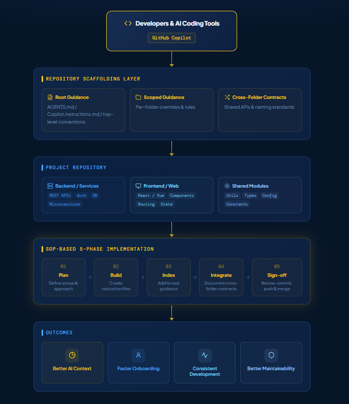

# 📁 Work Area 1: AI-Assisted Repository Scaffolding

## 📌 Context and Objectives
In an enterprise software engineering environment, keeping codebases organized and easy to navigate is essential for developer productivity. Modern engineering teams are increasingly using AI coding assistants like GitHub Copilot. However, without clear repository instructions, AI tools can easily generate out-of-context code or misunderstand how the project modules are structured.

This project focused on designing and setting up a standardized, **SOP-based repository scaffolding architecture**. I applied this structured layout style across three major **Digital Technology Enterprise (DTE) core application domains**:
* User resource ownership trackers
* Task management modules
* Centralized data lake systems

---

## 🛠️ The 5-Phase SOP Implementation Process

To turn repository organization from an ad-hoc task into a clean, repeatable workflow, the project setup was executed across five structured steps defined by the Standard Operating Procedure (SOP):

```text
  [01. PLAN]          [02. BUILD]         [03. INDEX]       [04. INTEGRATE]      [05. SIGN-OFF]
Define Scope &   ──→    Create     ──→   Add to Root   ──→   Document Cross-  ──rightarrow Review, Commit,
   Approach        Instruction Files       Guidance         Folder Contracts     Push & Merge
```

### 🔹 Phase 01: Plan
* Analyzed existing project setups to identify implicit folder rules, startup configurations, and coding conventions.
* Defined strict public-safe boundaries so that internal proprietary logic stayed fully protected while maximizing structural clarity.

### 🔹 Phase 02: Build
* Authored localized instruction files to list exact development rules for specific sections of the repository.
* Established clear validation requirements for folders handling runtime configurations, testing scripts, and data schemas.

### 🔹 Phase 03: Index
* Created primary instruction entry files (`AGENTS.md` and `Copilot.instructions.md`) right in the main root directory. These act as maps for both human developers and AI context parsers.

### 🔹 Phase 04: Integrate
* Documented cross-folder interface contracts explaining how different components pass data and interact with each other.
* Standardized naming conventions to ensure code consistency when moving between different sub-modules.

### 🔹 Phase 05: Sign-Off
* Conducted final checklist validations to confirm that the repository scaffolding layers were complete, readable, and fully followed team guidelines.

---

## 🏗️ Scaffolding Architecture Layout

The following diagram maps out how the structured instruction layers integrate with the core multi-stack components of the repository:



---

## 📈 Engineering Outcomes and Impact
* 🚀 **Efficient Team Onboarding:** Lowered the learning curve for new developers by turning tribal project history into highly visible folder blueprints.
* 🤖 **Improved AI Code Accuracy:** Created a clean, machine-readable documentation layout that helps AI assistants understand context boundaries, leading to more reliable code suggestions.
* 🧹 **Codebase Maintainability:** Eliminated structural clutter by linking individual folder layouts back to a single shared configuration standard.
