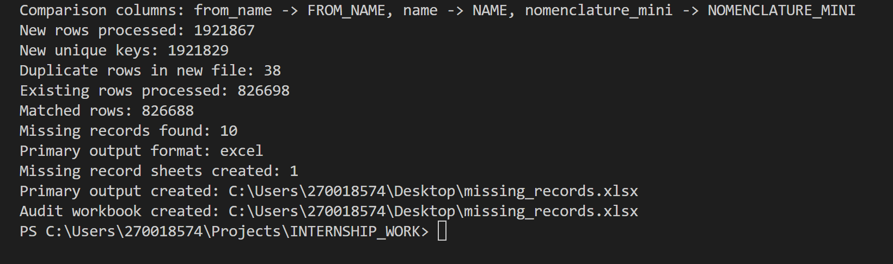

# 🛡️ Work Area 2: Application Issue Investigation & Validation

## 📌 Context and Objectives
This work area focused on shifting from proactive project organization into active bug tracking, analytical problem-solving, and solution planning. A data visibility issue was flagged on a core **DTE record management application** regarding how records were discovered and how data ownership was handled under specific production conditions. 

In a professional engineering environment, an investigation rarely begins with a clear diagnosis. Instead, it starts with incomplete signals—such as user observations, inconsistent data patterns, and missing cases. The primary goal of this project was to convert these ambiguous concerns into structured, measurable problem statements. From there, I performed a collaborative root cause analysis and designed a data validation strategy to support a public-safe proposal for improved query logic.

Rather than jumping directly to production deployment, this contribution focused on the critical engineering phases of problem diagnosis, solution planning, and technical handover. It emphasizes evidence-based engineering over intuition by using data metrics to justify long-term software maintainability.

---

## 🔍 Root Cause Analysis (RCA) Methodology

Instead of applying a superficial quick-fix, I investigated the issue across three main technical dimensions to find the exact root cause:

1. **Query Behavior and Database Filters:** Audited the active database retrieval queries to check if the filtering rules were too strict or accidentally dropping valid records.

2. **Application Logic and Code Flows:** Checked the backend view models and routing classes to trace exactly how the system handles missing data associations or null values.

3. **Search and Sync Pipelines:** Evaluated whether database synchronization delays or field index mismatches were preventing ownership records from updating correctly.

The investigation revealed an inconsistency in how missing data boundaries were evaluated, allowing us to plan a stable, null-safe solution path.

---

## 📊 Data Validation Framework (Python)

To ensure the proposed query changes worked perfectly without breaking existing functionality or creating duplicate data noise, I developed a custom **Python validation script** to analyze outputs at scale.

### 📈 Script Execution & Validation Metrics
The validation script processed a massive dataset through automated cleaning, normalization, and auditing filters. All execution pipeline metrics were logged directly to the console dashboard:

The script successfully isolated all data gaps and automatically generated a targeted audit spreadsheet (`missing_records.xlsx`) containing the mismatched items for the engineering team to review.

---

## 📈 Project Impact and Handover Status
* 💡 **Data-Backed Proof:** Replaced assumptions with concrete testing proof by verifying our solution across **1.9M+ active rows** shown in the pipeline logs.
* 🛡️ **Risk Reduction:** Prevented future breaking changes by making sure the new query logic fixed the missing edge cases without changing steady-state data.
* 📦 **Team Handover Readiness:** Packaged our problem documentation, solution summaries, and the runnable Python scripts into a clean handover archive to ensure the long-term engineering team could easily continue the work.
